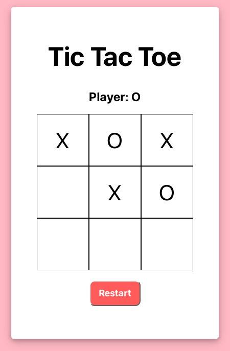

To begin, the players are provided with a blank Tic Tac Toe Board. Right above the board is some text specifying which player's turn it is. After Player X makes his/her move, the text above the board will update to show that it is Player O's turn. A Restart button has been placed below the board.  

