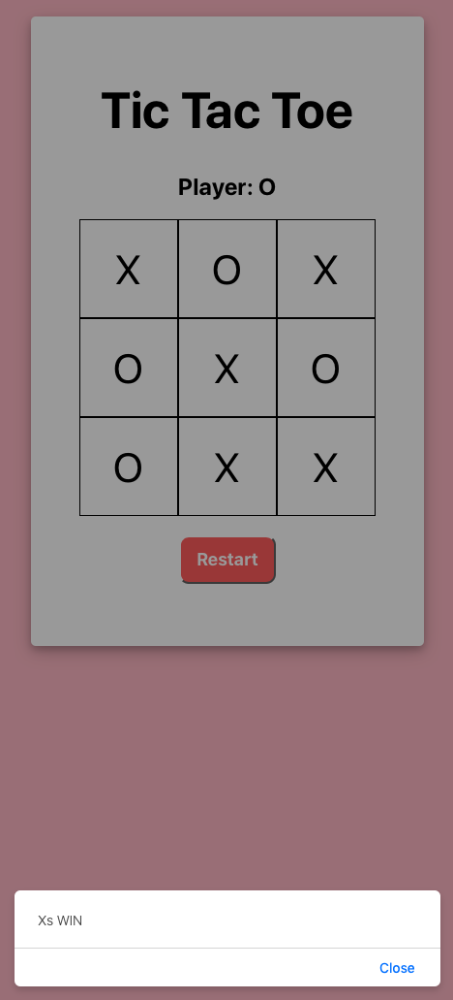

To begin, the players are provided with a blank Tic Tac Toe Board. Right above the board is some text specifying which player's turn it is. After Player X makes his/her move, the text above the board will update to show that it is Player O's turn. A Restart button has been placed below the board.  

A player wins when they are able to place three of their symbols (X's or O's) in a row onto the board. When this occurs, a message will display below the board indicating which player has won. Upon closing the message, the board will automatically reset.

In the event that the game ends in a stalemate, a message will display below the board indicating that the game is a draw. Upon closing the message, the board will automatically reset.

